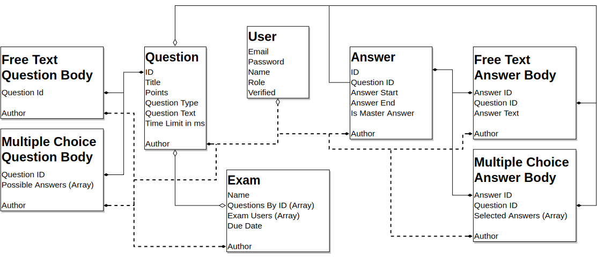

<!--
Tags:

- <cite>: Needs citation
- <!--   : Comment
- <review> : need review
- [!!]: Marked, bad sentence or word
-->

<!-- Taking the current pandemic under consideration, it may not be an option to just move from paper to e-exams. Exams thus must be conducted decentralized, i.d. students take their exams at ho  me. -->

\def\checkmark{\tikz\fill[scale=0.4](0,.35) -- (.25,0) -- (1,.7) -- (.25,.15) -- cycle;}

\begin{abstract}Examination is one of the few parts of education which has not profited from digitalization. However, electronic examination can make the assessment process faster and more valid. Especially, with respect to the current pandemic, e-exams are not only an opportunity for improvement but have become necessary. To ensure sound e-assessments, an examination system must meet certain requirements. We develop these requirements and give insight into the design principles that help us match them. These design principles are used to evaluate popular e-examination tools. We find none of them fully meeting the proposed requirements. Especially, in areas of cheating prevention and protection against contestation these tools fall short. With the aim of constructing a better solution, we propose an examination tool prototype. In order address the shortcomings of the other tools, this prototype provides offline capabilities and per question time constraints. It thus lays a foundation for modernizing exams.\end{abstract}
\newpage
\listoftables
\listoffigures
\newpage
\section*{List of Abbreviations}

**LMS**: Learn Management System  
**BYOD**: Bring Your Own Device

\newpage
\tableofcontents

\newpage

# Introduction

Examinations make up a crucial part of education. Great amounts of time go into organizational overhead. Although digitalization has found its way into many parts of education, assessment largely is not one of them. However, a step towards digital examination (e-exams) would make the assessment process more flexible, scalable and resource-efficient. Meanwhile, e-exams can lead to a more accurate depiction of a students' competence.

In general, e-exams are advantageous in numerous ways. Their digital nature makes exam data easy to analyze. This analyzing creates insights into the performance of students and the quality of exam questions. Compared to paper based exams, logistics become more efficient, as physical answer sheets must no longer be moved around. As an exam is no longer bound to the physical answer sheet, exam are no longer location-bound. Exams could be taken at any place with internet and power connection. This reduces efforts in exam location planning. Additionally, archiving exams becomes faster and more space-efficient. Further, we find advantages in the way questions are asked. Question formats are no longer bound to paper. Thus, more application-oriented questions can be asked and knowledge can better be assessed.

Digitizing exams is no novel idea. However, many concepts and implementations focus on conducting e-exams in the same physical environment as _paper-based exams_ [@Vogt2009]. This results in exams that are either conducted on the universities' hardware [@JohannesGutenberg-UniversitatMainz] or in so-called _bring-your-own-device_ (_BYOD_) exams [@GLM2015]. The former is associated with high investments in computer infrastructure. It is evident, that students need to own an electronic device (e.g., a tablet or laptop) to participate in university. Taking this into consideration, _BYOD_ solutions become the most sensible option.

In the face of a global pandemic, the gathering of large groups of students poses health risks. The organization of exam locations, thus, has become increasingly more difficult. More locations with larger areas are needed in order to fulfil the needs of assessments. As discussed above, using the examinees' own device, e-exams can be taken independently of any location planning--even at the examinees' own home. This decentralization eliminates the overhead that results from the allocation of locations to different exams.

Taking these points into consideration, we will discuss decentralized e-exams in more depth. It is important to notice, that _decentralized e-exams_ differ from _paper-based exams_ and _centralized e-exams_ in several key points. Foremost, the examiner has less control over the environment under which the exam is taken. This raises questions about exam integrity and fairness. These questions must be addressed through careful conceptualization of questions and careful software design.

Evidently, to some degree _e-exams_ are already conducted today. Some solutions, for example, make use of a _proctoring system_. In such a system, a supervisor can access the examinees' device, he can monitor all the students activities and surveil them through their webcam. Proctoring of students aims to prevent or at least detect cheating. However, this approach is costly, it hardly scales and provides no real protection against cheating. Furthermore, test-taking applications are found in many _Learn Management Systems (LMS)_. These systems are especially well suited for self-assessment. Their suitability for a real exam majorly varies in quality.

This thesis thus focuses on decentralized e-exams that renounce the usage of a proctor. For this purpose, we identify requirements that need to be met to allow for a sound exam. We then find design principles that help us match these requirements. As a guideline, this thesis uses a design-oriented research approach. @Hevner2004 propose guidelines to conduct design-oriented research. This thesis pursues these guidelines as follows:

1. **Design as an artifact:** The result of this research project is an IT artifact. It provides an implementation of a specific electronic exam. This artifact acts as a prototype for a product that ultimately aims to be used in the real-world examination process.
2. **Problem relevance:** Exams are the only part of education that has not made use of digitalization. E-exams could allow for a cheaper and more accurate way of assessing students.
3. **Design evaluation:** The effectiveness of the artifact is based on the effectiveness of design principles that are derived from research and intuition.
4. **Research contribution:** There are few systems designed for providing high validity. Many systems that do exist, make use of _proctoring environments_ (the student is continuously surveilled) which are expensive and can still be fooled. This research artifact aims to minimize academic dishonesty through design decisions.
5. **Research rigor:** This thesis builds upon research in the fields of education. It takes into account what other universities have already incorporated into their examination process and what empirical studies have shown to be valuable and efficient.
6. **Design as a search process:** Digital exams are no new concept. Still, it is not widely adopted. This thesis builds upon the works of different software artifacts and research conducted in the field of education.
7. **Research communication:** This thesis focuses on illustrating design considerations that were made in order to develop an artifact that most closely fits the needs of sound assessment. Therefore, this thesis focuses more on the concept and design principles needed to achieve a suited examination system. However, as we developed a prototype for conducting exams, we will also cover the technical implementation of various design principles.

<!-- Maybe add an Section overview  -->

\newpage

# Requirements for E-Exams

We find e-exams to be advantageous in a variety of ways. Still, it must be ensured that e-exams meet the same standards that are asked for in paper-based exams. For this cause, we define requirements as a framework for any examination. @Handke2012 provide such requirements. In this thesis, we ask how to design sound e-examination software. For this purpose, we focus on topics that are directly influenced by such software. We do not consider issues concerning the content of the exam. Further, we divide the given requirements into three broad categories:

The first requirement defines the desired outcome of an exam:

1. **General Validity.** Exams should aim to provide an accurate depiction of an examinees' competence level.

Further, we find requirements that mainly influence interactions of examinees and examiners with the examination system:

2. **Protection against contestation.** No formal or technical deficiencies should occur that question the validity of the exam.
3. **Equal treatment.** Individual examinees must be treated equally.
4. **Protection against cheating.** The exam's outcome must be protected against manipulation by examinees.
5. **Transparency.** The examination process and results must be understandable and verifiable.

Lastly, we determine requirements that mainly influence the technical implementation of how the examination system handles data:

6. **Protection of data.** The data of examinees is personal. As such it must be protected from misuse.
7. **Integrity.** Exam data must maintain consistency, accuracy and trustworthiness throughout its entire lifetime.
8. **Attributability.** A taken exam must uniquely map to a single examinee and vice versa.

These categories set a general framework of how to design any examination system. Table _1_ shows the design principles needed in order to match the requirements mentioned above. In the following, we will discuss these design principles.

\begin{center}
\def\arraystretch{1.5}
\begin{table}
\begin{tabular}{ | l | p{9cm} |}
\hline
Requirement & Design Principle \\ \hline

\multirow{2}{6cm}{1. General Validity}

& \textbullet Per question time constraints \\
& \textbullet Multiple question types \\ \hline

\multirow{2}{6cm}{2. Protection against contestation}

& \textbullet Offline capabilities \\
& \textbullet Students should be advised to ensure a reliable exam environment \\ \hline

\multirow{2}{6cm}{3. Equal Treatment}

& \textbullet Device agnostic \\
& \textbullet Exams must leverage automation wherever possible \\ \hline

\multirow{4}{6cm}{4. Protection Against Cheating}

& \textbullet Creation and management of large question pools \\
& \textbullet Per question time constraints \\
& \textbullet Randomization of question order \\
& \textbullet Providing a sense of surveillance \\ \hline

\multirow{2}{6cm}{5. Transparency}

& \textbullet Examiners must be able to give feedback to answers \\
& \textbullet Feedback must be reviewable by students \\ \hline

\multirow{3}{6cm}{6. Protection of Data, 7. Integrity and 8. Attributability }

& \textbullet User rights management \\
& \textbullet User action logging \\
& \textbullet Codebase is open source \\ \hline

\end{tabular}
\caption{\label{tab:Requirements_with_matching_design_principles}Requirements and their Respective Design Principles}
\end{table}
\end{center}

## General Validity

Examinations should support the purpose of universities to produce highly capable individuals [@Halbherr2014]. The measurement of success in that aspect is largely based on the students' performance in exams. Subsequently, students are highly incentivized to focus their studies on a specific exam format and its question types. This interdependency between knowledge acquisition and the examination shows the importance of exam design. Further, it poses the question of what and how to test. We find different question types to be particularly well suited for testing specific aspects of learning. These question types can be defined as follows [@Halbherr2014]:

- **(Semi) Closed questions**, mainly revolve around the demonstration of _factual knowledge_. Solutions are not disputable; there are only right and wrong answers. Typical answer formats include multiple-choice and simple text . _For example: "What does *BYOD* stand for?"_
- **Competence questions**, are suited to test for a certain _practical skill_. Solutions are given in form of an implementation of the specific task at hand. _For example: "Using the provided software, implement an e-exam about e-learning."_
- **Essay-type questions**, are suited for assessing _transfer knowledge_ and _understanding_. Solutions are given by free text input. _For example: "Explain why subjects in computer engineering are especially well-suited for e-exams."_

Further, different degrees of allowed aid for a question can be identified: In open-book exams, students are allowed to solve the question at hand using any resource. These open-book exams rely mostly on both competence and essay-type questions. It could be argued that these types of questions resemble a real-world scenario in which access to information is rarely limited. Meanwhile, closed question are rendered insignificant in such open-book exam situations, as simple factual knowledge is easily accessible. In order to ask closed questions, it is necessary to restrict access to any aid.

Classic paper-based exams do not provide a feasible way of combining degrees of allowed aid. Therefore, some question groups tend to be neglected. This constrains the possibilities to create an accurate depiction of an examinees' actual competence [@Cluskey2011]. With e-exams, on the other hand, we can implement such a varying degree of usable aid, creating a _partial_ open-book exam. This can be achieved by letting students generally use any resource they need to answer the question. Additionally, we introduce per question time constraints. These time constraints can be adjusted according to the question and question type. Leaving closed questions with a strict time constraint and creating an _either-you-know-it-or-you-don't_ situation, where the student has no time to look up any solution. Essay-type questions, just as competence questions, can employ more generous time frames, giving the examinees freedom to make use of their tools.

Ultimately, examination software does not directly impact on what exact questions the examiner asks. The content of a question predefines how well this question can predict an examinee's capabilities. Still, the use of a partial open-book mode allows for a diverse set of questions. This mode allows to test factual, transfer and practical knowledge to an equally valid degree.

For the requirement _2.1._, we thus find two main design principles. The first principle is the usage of multiple question types. The second is the enforcement of per question time constraints.

## Protection Against Contestation

<!--
Matching desing principles:

- Making the exam offline compatible.

- Caching answers while taking the exam.
-->

Building upon aspects talked about by @Handke2012 we can find ways to adress requirement _2.2_. Contestation of entire paper-based exams is not a common problem. This is a result of the controlled environment of paper-based exams. Adding, the medium used to test examinees (i.e. paper) is fail-safe. E-exams, especially decentralized ones, introduce the possibility of failure of the exam medium. @Handke2012 propose a client-server application for an examination tool. These tools rely on software, the operation of an electronic device and internet connection. Failure of the exam medium can lead to students contesting the validity of the exam.

The reliability of the exam medium is most dependent on the e-exam software. As with any software, high reliability can only be achieved through rigorous testing and continuous improvements.

Another important point is device the operability. Decentralized e-exams are taken on the examinee's device. It thus largely lies within the responsibility of the device owner to ensure that it is working as intended. It must be mentioned that modern devices generally show low failure rates. As students in any way need a reliable device to participate in their studies, device operability is not a major problem. Still, the examination tool can prevent unnecessary device failure by strongly advising examinees to keep their devices updated, plugged into power and to not use unreliable devices. @Halbherr2014 also demand good user experience, as in hight stress situations the exam medium must not stand in between the exam and the examinee.

The last major point in which the exam medium can fail, is connection loss that leads to time deficiencies for students. In normal operation, exam answers should continuously be sent to a server to minimize the risk of data loss. In case of connection issues, students must be able to continue their exams without problems. Data must then later be sent to the server. In case of both a device crash and internet failure, the exam should persist on the local storage of the device. The device can then be rebooted, and the exam can be continued. Although applications can have some offline capabilities examiners only fully control the server side. Following, @Handke2012 are advocates for high security in all parts that are still controlled by examiners. Only in this way can exams protect themselves from contestation.

For the requirement _2.2._, we thus find three main design principles. The first principle is the continuous improvement and sound testing of exam software. The second is advising examinees to ensure their device is working as intended. The last is taking connection issues into account and being able to handle them.

## Equal Treatment

<!--
Matching design principles:

- Providing a cross platform solution.

- Allowing for randomized exam correction.
-->

Equal treatment of examinees should be ensured throughout the entire examination process, reaching from taking the exam to its correction.

Possible inequality arises in some key areas. In _BYOD_ exams, student devices are largely heterogeneous--they run different operating systems and consist of different hardware. This fact should not lead to different exam-taking experiences [@Handke2012]. The choice of hardware should be largely irrelevant. Consequently, it makes little sense to develop proprietary software for each operating system. Modern web technologies provide a common language among different systems. Web applications do not lack speed or functionality and can be adopted cross-platform. The software is hosted at a central entity where it can be maintained and improved. The software artifact is then delivered via a modern browser. The examination software thus should rely on internet technologies.

The process of correcting exams is another an area where possible inequalities can be found. Especially the correction of exams by hand is immensely time-consuming, this may result in fatigue and thus sometimes in answer checking mistakes. Besides accidental mistakes, @James1927 has found negative bias towards students with bad handwriting. He found students with bad handwriting get categorically worse grades than students with better handwriting.

By using e-exams, these inequalities can be evened out @Halbherr2014. First, some question types, such as multiple-choice questions can be checked automatically, leading to an immediate improvement over correcting these questions by hand. This leads to a lower correction load and thus to fewer correction mistakes. Second, as exam answers are available in digital text, reading and checking answers is easier. Answers must not be deciphered; correction of exams can be done faster. Meanwhile, e-exams can also eliminate biases against certain students connected to their handwriting.

For the requirement _2.3._, we thus find two main design principles. First, the software should be device agnostic. Second, the system must leverage automation possibilities.

<!--
Adding, the digital nature of exams makes it possible to give visual aid to the corrector. Automatically highlighting specific terminology can help correctors to faster check students answers.
-->

## Protection Against Cheating

<!--
Matching design principles:

- Creating a feeling of being survailed.

- Making use of large question pools.

- Randomization of questions.

- Make use of partial open-book exams.
-->

When thinking about any assessment, considering and handling academic dishonesty is one of the most important parts. Moving from paper-based to e-examination poses the question of what parts must be adjusted to accommodate for changed circumstances and environments.

@Mccabe2005 poses seven fields of possible cheating in exams which he then evaluates by occurrence and perceived severeness. Six of which are relevant for this thesis' purpose.[^1] These fields can be described as follows:

[^1]: The seventh would be _"Using false excuse to delay test taking"_.

**Student cooperation**:

- **Knowing the questions.** Learning about the exam content from someone who has already taken the test.
- **Cooperation with outsiders.** Receiving disallowed help from someone outside the examination context.
- **Cooperation with fellow examinees.** Copying from another student during an exam with them knowing or working together to solve questions.

**Use of disallowed aid**:

- **Exploit environmental circumstances.** Copying from another student during an exam without them knowing.
- **Use of unauthorized notes.** Bringing prepared cheat notes to use in the exam.
- **Use of electronic, unauthorized aid.** Using search engines or the lecture material to solve questions.

Before thinking about how to obviate these cheating scenarios, an important statement must be made: Cheating cannot completely be eliminated. There are always means for students to engage in cheating. Although e-exams cannot change this fact, we can find measures to prevent cheating to a certain degree.

**Knowing a question.** The creation of questions is a time-consuming process. Thus, an examiner's strategy may be to keep questions as secret as possible and reuse them throughout multiple exams [@Gehringer2004]. This is a rather ineffective strategy as platforms such as Studydrive[^studydrive] often provide comprehensive exam protocols. These protocols are contributed by examinees who have already taken a given exam. The digital nature of e-exams inhibits the use of the above approach. Students are able to capture questions and distribute them even faster and more accurately. Thus, e-exams must choose a different solution. Instead of having few questions and keeping them secret, e-exams have to leverage large question pools. As question pools grow larger, it becomes unfeasible for students to _know_ every available question.

[^studydrive]: https://www.studydrive.net/

**Cooperation with other examinees.** For _closed questions_, this cooperation can be prevented by using tight time restrictions. As already stated above, these questions fall into the category _either-you-know-it-or-you-don't_. There is no need for a lengthy reflection period. With these short time frames, there is no time for cooperation with others. For more open question types, time limitations are not as tight. At the same time, answers require more in-depth considerations. To ensure that students write down their own ideas and do not share their thoughts, the input possibilities must be limited. Copying and pasting should be disabled to prevent the sharing of answers between students. To further inhibit cheating, the order of questions should be randomized, and the navigation between questions should not be allowed.

**Cooperation with outsiders.** As decentralized e-exams are not conducted in a controlled environment, cooperation with outsiders becomes a severe problem. Examinees could try to take the exam in the presence of an expert. Some try to solve this problem by using proctored e-exams. These exams use live surveillance through webcam and microphone evaluated by a person watching in real-time. This approach hardly scales as for every 4-5 students, a supervising proctor is needed. Programs like @ETSTOEFL can use such a system, as their high test fees leave room for additional expenses.

Although live surveillance of students is not a valid option, the psychological effects of being monitored can be leveraged. A measure might be to employ integrated webcams and microphones of the devices at hand. This video and sound data can be reviewed if needed. More importantly, it creates a mental barrier to cheating. If examinees commit to academic fraud, they will most certainly find a way to do so. The goal is to prevent those from cheating, that would only cheat if there was no threat of being caught. As @Halbherr2014 put it: "[...] sitting an online exam on an unsecured computer, fraud is all too easy, and tempting". Thus, it must be the goal to make cheating less tempting. The sole existence of any measures makes students behave more honest. This can be compared to video surveillance that makes crime less common in public places [@WELSH2004].

**Exploit environmental circumstances.** Again randomization can solve this problem. As questions appear in a different order for each student, even multiple-choice questions cannot simply be copied.

**Use of unauthorized cheat notes or electronic aid.** Following the argument made about partial open-book exams, we find that besides time constraints no additional measures must be enforced. Cheat notes are redundant if there is no time to use them.

We find e-exam software to be able to enforce measures against cheating. Still, as specific software is in use, the degree of cheating must constantly be assessed. Further software bugs must be fixed, while security flaws must be identified and resolved.

For the requirement _2.4._, we find four main design principles. First, the creation and management of large question pools must be possible. Second, per question time constraints should be enforceable. Further, the question order must be randomizable. Lastly, a way to create the feeling of being surveilled should exist.

## Transparency

The examination process should be transparent for examinees. Students must be able to understand their mistakes and shortcomings. This implies that the exam software provides ways to give feedback. Further, as examiners are not free of mistakes, corrections can sometimes be faulty. Well implemented transparency allows students to review the examiner's correction and contest against individual corrections. Important to mention is that every student should get the chance to review their exam. The digital nature of e-exams makes this degree of transparency easy to realize [@GLM2015]. Sharing a corrected digital copy of an exam, allows examinees to review their answers and understand their knowledge gaps. Contestation against specific corrections could also be processed within the exam software.

For the requirement _2.5_, we thus find two main design principles. First, the examiner must be able to give feedback to answers. Second, this feedback must be made available to the student.

## Attributability, Protection of Data and Integrity

Exam data is highly sensitive and demands high levels of information security [GLM2015]. As with any information system, fundamental information security principles apply. The following points prove to be of special importance.

Exam data must be uniquely traceable to examinees. This can be realized by having examinees log into a user account before they can perform any action. Examinees either get a unique identifier in-software or a unique identifier that is provided by the testing authority. Any of their actions is then linked to their user id.

To ensure solid data protection, strong user rights management must be enacted. This guarantees that only authorized groups can view or correct exams. In this way, data is largely protected from misuse.

<!-- Das hier ist einfach noch schlecht! Ist aber ein punkt für integrity and data prot-->

This measure ties into the integrity of exam data. As access is restricted, exam data cannot be changed. To provide even more security, answerers can be sent to a central server instance as soon as students continue to the next question. Further, frequent database backups of the exam data should be standard procedure.

Another consideration to take into account is the availability of the source code. Processes should be completely transparent and comprehensible. Exam authorities should be able to host exams themselves. This can be achieved by providing the exam software in open source format. Adding, an open source format can leverage crowd participation to render software more bug-free and eliminate existing security flaws.

For the requirements _2.6_ through _2.8_, we thus find three main design principles. First, sound user rights management must be enforced. Second, user actions must be traceable. Third, source code should be well maintained and open source.

In the previous section we have developed design principles. These principles allow as to create a valid examination solution. Further, it allows us to evaluate existing solutions and also create a software artifact ourselves.

\newpage

# Evaluating Examination Software

As mentioned, in this thesis we will evaluate five popular software alternatives:

- Ilias[^ilias]
- Moodle[^moodle]
- OpenOlat[^open]
- Blackboard[^black]
- LPlus[^lplus]

[^ilias]: https://www.ilias.de/
[^moodle]: https://moodle.de/
[^open]: https://www.openolat.com/
[^black]: https://www.blackboard.com/de-de
[^lplus]: https://lplus.de/home

These five systems consist of popular e-learning applications used by large parts of German higher education. _Illias_, _Moodle_, and _Open Olat_ are open source and free to use. Both _Blackboard_ and _LPlus_ are closed source and are paid products. Besides _LPlus_, all of the products are learning management systems (LMS). A learning management system provides management of the complete e-learning process in a single application. LMS allow for the distribution of teaching material, exchange between students, and provide a platform for educators to get in touch with their students. The systems discussed here also incorporate e-assessment features. German universities often have such LMS in operation. Using the integrated assessment tools becomes a seamless experience for these institutions. While this appeals in theory, the integrated assessment capabilities still need to be evaluated. We will measure the quality of all five tools based on their degree of fulfillment of the requirements and design principles we laid out in section _2_.

As a baseline, all these tools are market-ready products. All of them have user management with respective permissions, and are actively maintained, laying a foundation for the _protection of data, attributability and integrity_. Further, all of them rely on a browser to provide their services, thus being device agnostic. They also leverage automation where it is possible. Thus, they match requirement _2.3_.

## General validity

All products allow a variety of question types, thus partly matching the first design principle. To completely fulfil the requirement _2.1._, exams need to enforce per question time constraints. Here only _Open Olat_, and _LPlus_ can provide such a feature. The other systems allow for time constraints to be set on the whole exam; time limits on a per question basis are not possible.

## Protection against contestation

One of the biggest shortcomings of the software at hand is their way of handling connection errors. All of them rely on a stable internet connection. Loosing connection forces the student to wait until the connection is reestablished. This is especially problematic with questions that rely on time restrictions. Answers that are in theory timely answered are not sent to the server in time. Adding, students cannot continue the exam but instead have to wait for the connection to reestablish. Not providing a student with an adequate way of solving an exam despite these minor but common problem, this could lead to contestation.

## Transparency

In terms of transparency _LPlus_, _Open Olat_ and _Moodle_ all perform well. They provide a way to give feedback to specific questions. Students can review both their exam results and the given feedback. Still, direct contestation of corrections is not possible in-app. Thus, this process must fall back on other means of communication. _Ilias_ and _Blackboard_ are very limited in giving feedback. The only feedback a student can get is the points he has achieved.

## Protection Against Cheating

As mentioned above, only _LPlus_ and _Open Olat_ provide a way of creating partial open-book exams. Time restrictions are the main tool for preventing several ways of cheating. Exams created with _Ilias_, _Blackboard_, and _Moodle_ can only rely on open question types, or they risk cheating of students.

None of the systems provide a way for visual or auditory supervision. Students are only identified by their password and username. Such authentication can easily be shared and provides no sound authentication. Lack of authentication thus opens up possibilities of students getting help from outsiders.

Another topic where the systems fail is the restriction of input. Copying and pasting is not disabled. Further, logging of keystrokes or similar measures for monitoring a student's input methods are not enforceable.

Exams must be customizable in such a way that students cannot jump between questions, cannot re-answer questions and can only see one question at a time. This customization is found in _Moodle_, _LPlus_ and _Open Olat_. Both _Ilias_ and _Blackboard_ are limited in that regard.

Lastly, all the tools allow for the randomization of the question order in an exam. Adding, every tool provides a way of creating and maintaining a question pool. Questions can also be imported and exported, theoretically allowing for sharing between examiners. However, this sharing can only be done manually via non-standardized means of communication. In reality, sharing at platform-magnitude must be envisioned. None of the products can provides such a platform.

## Protection of Data, Attributability, and Integrity

With respect to _protection of data, attributability, and integrity_, all solutions provide user management with different roles and permissions. Adding, all the products are actively developed and thus, continuously improved. The wide usage of the products at hand proves their capabilities to meet any legal data protection requirements. Further, no major security flaws in the software are known.

## Further Considerations

As already mentioned above, most of the systems currently in use are LMS. They do not fulfil all the requirements needed for an exam. Problematically, due to their heavy integration with every part of a university's system, LMS are not easily swapped out. Instead, it may be advantageous to use a standalone solution that uniquely focuses on providing e-exams. This fact is a major motivator in designing the artifact of this thesis.

## Discussion

\def\arraystretch{1.5}
\begin{center}
\begin{table}
\begin{tabular}{ | p{7cm} | c | c | c | c | c | }
\hline

                                                              & Ilias & Moodle & OpenOlat & Blackboard & LPlus \\ \hline

Multiple question types & \checkmark & \checkmark & \checkmark & \checkmark & \checkmark \\ \hline  
Device agnostic & \checkmark & \checkmark & \checkmark & \checkmark & \checkmark \\ \hline  
Exams must leverage automation wherever possible & \checkmark & \checkmark & \checkmark & \checkmark & \checkmark \\ \hline  
Creation and management of large question pools & \checkmark & \checkmark & \checkmark & \checkmark & \checkmark \\ \hline  
User rights management & \checkmark & \checkmark & \checkmark & \checkmark & \checkmark \\ \hline  
User action logging & \checkmark & \checkmark & \checkmark & \checkmark & \checkmark \\ \hline  
Codebase is open source & \checkmark & \checkmark & \checkmark & & \\ \hline  
Examiners must be able to give feedback to answers & & \checkmark & \checkmark & & \checkmark \\ \hline  
Randomization of question order & & \checkmark & \checkmark & & \checkmark \\ \hline  
Examiners must be able to give feedback to answers & & \checkmark & \checkmark & & \checkmark \\ \hline  
Per question time constraints & & & \checkmark & & \checkmark \\ \hline  
Offline capabilities & & & & & \\ \hline  
Advising student to ensure a save exam environment & & & & & \\ \hline  
Providing a sense of surveillance & & & & & \\ \hline

\end{tabular}
\caption{\label{tab:Requirements_with_matching_design_principles}Tools and The Design Principles they Match}
\end{table}
\end{center}

As a matter of fairness, it must be mentioned that all these tools are not advertised to be used in a decentralized e-exam context. The assessment tools that are integrated into the LMS are especially aimed at self-assessment. The _LPlus_ software is primarily used in a central e-exam context, where examinees have control over student interaction an often even over the hardware. However, numerous institutions use the discussed tools, they will likely employ to conduct e-assessments.

To conclude, none of the mentioned systems meet all the proposed requirements. The advantages e-exams provide in comparison to paper-based exams make the development of such an application compelling. As the Covid-19 crisis has put even more pressure on the examination process, the need for an artifact that meets all requirements has become even more urgent.

\newpage

# Designing an Examination Software Artifact

In the following, we will discuss how a software artifact can implement these design principles from a technical point of view. Further, as a proof of concept, two design principles are implemented in a software prototype. This prototype helps determine software architecture as well as used technologies for effective e-examination. The first part outlines the data structure of the artefact, followed by a brief introduction into the technologies employed. All these statements will be made with the exam requirements introduced in section _2._ in mind.

As mentioned earlier, open source code can allow for more secure and transparent software. Consequentially, the source code of this artifacts front- [@XM-Frontend] and back-end [@XM-Backend] is available on Github under the MIT open code license.

## Data Structure and Architecture

The artifact is a client-server application. The front-end (client) is responsible for the interaction with both examinees and examiners and a back-end (server) for data handling. The back-end server runs on a Node.js [@Node] server, while the front-end is delivered via any modern browser, thus fulfilling the requirement _2.3_.

The client and server-side communicate over a simple REST API. The advantage of a client-server application lies in the separation of the data and the end-user. Users do not have direct access to data but any read- or write-action must be executed over an API. Here permissions can be checked and possible misuse inhibited. Additionally, as the user has no direct influence on the server's actions, the latter can act as a source of truth. Once committed data is now immutable. For example, the foraging of exam answers after submission becomes impossible. The API can also provide different kinds of endpoints for interaction with different users. Examiners, for example, can use one API endpoint to create exam questions, whereas students will get an error code if they try to interact with the endpoint.

One of the most important design considerations is the data model that is used to store and access exam and user data. As is shown in figure 1, there are four central instances:
The most critical data instance is the _question_. Especially with the creation of question-pools in mind, it is clear that these _question instances_ must live independently of any exam. A question consists of a title, the question type, the question text, the question's points, and the question's time limit. Further, each question has a question body. The shape of the question-body depends on the question type. For example, the multiple-choice question-body consists of a reference to the question it belongs to, and a selection of possible answers. For free-text questions, no body is needed. Still, to be consistent in the data structure, and to allow for later additions, free-text questions also have a body.

These questions can then be assembled into the second central instance, the exam. Each exam contains an exam name, the users that are allowed to take part in a given exam, and an exam date. Most importantly, an exam contains a list of question ids, which constitute the exam content.

The third central instance is the user. Users can either be examinees or students with each having different permissions. Students, in contrast to examiners, can not create exams or questions. If any new data instance is created, e.g. a new question, the _author_ property is set to user performing the request. Further, users possess an email, a password, a name, and a unique identifier property. The id is provided by the application but could also be an identifier given by the testing authority, as can be seen in figure _2_. With user handling and automatic assignment of authorship, we can ensure _2.8_ and, to a large degree _2.6_ and _2.7_.

The last key instance is the answer. For each question, an examinee answers an _answer instance_ is created. This instance contains a timestamp at which the question is started, a timestamp at which the question was answered, and the question-id the answer is referring to. Additionally, the answer object provides a flag that marks it as a master answer. Master answers are the correct answers, or in the case of free-text questions, provide a guideline of what is to be considered correct. These master answers can only be created by examiners. Analog to the question, the answer also bears an answer-body. The form of this body again depends on the question type. _Multiple-choice answer-bodies_ contain the selected answers, whereas _free-text answer-bodies_ contain the given free-text answer. Additionally, any answer body contains a reference to the answer and to the respective question using its id.

The above provides an overview of the data structure, as it is found in the database. As this app inhibits offline capabilities, large portions of this data structure can again be found in the front-end application. Of course, the data is reduced to the data that a user, e.g a student, is allowed to see. Still, the structure of questions and answers remain identical. To realize the mentioned offline capabilities, the exam data persists in the local storage of the browser. Data remains in this local storage until deleted by the app or intentionally removed by the user. If there is an internet connection the data on the server and the data in the local storage remain the same. Should the internet connection fail, the exam continues as normal. Answers are then saved to the local storage and at a later point in time, send to the server. Depending on the circumstances students are taking their exams under, examiners can adjust the degree of offline capabilities. Students could be allowed to take their complete exam in offline mode. At the end of the exam are they required to submit their answers. With the handling of offline capabilities, we can ensure the requirement _2.2_. Further, critical information to ensure a save exam environment are provided at the beginning of the exam. This can be seen in figure _2_

To provide a way to meet requirement _2.1._ and to fulfill parts of the design principles to ensure _2.4._, the front-end application must enforce per question time constraints. The back-end can review the actual time used to give an answer. Still, the user interface must assist the student in taking only as much time as allowed. The artifact achieves this by showing the remaining time and submitting the currently provided answer as soon as time is up, as seen in figure _3_. This answer is then sent to the server. Students are thus forced to comply with the respective time constraints, leaving them no room to accidentally miss allowed times, this can be seen in figure _4_.

\newpage

## Technologies in Use

Both the server and the client side are written in a coding language called JavaScript. It is the most popular language on Github [@Octoverse]. JavaScript allows programmers to realize a complete web app using only one language, making it a compelling option when writing such an application. Besides, many modern and popular libraries for web development are written in JavaScript. Some libraries also find use in this artifact, the most crucial being React created by Facebook and the Express framework [@Express].

React is "a JavaScript library for building user interfaces" [@FacebookInc]. It uses structures that are divisible in reusable components. React makes it easy to create complex applications instead of simple websites. It was originally created by Facebook and finds its use in the tech-stacks of Uber, Airbnb, Netflix and many more [@Techstack]. Further the front-end uses the JavaScript superset TypeScript. TypeScript allows to define and check for complex types, whereas JavaScript in general is typless. These types allow for more secure data handling, making the application overall less prone to bugs. Lastly, an UI-library is used to create a visually more pleasing experience.

Express is a common library for the creation of back-end services. It is lightweight and allows for the creation of both simple and complex APIs. As many back-end-applications rely on the same structure, generators for the fundamentals exist. For this artifact, we used the _Rest API Generator_ [@Scholz]. The express server also handles data storage; for this purpose a database is connected. The artifact uses a noSQL database called MongoDB [^mongodb]. MongoDB does not store data in tables, but in JSON-like documents. The JSON format is inspired by JavaScript objects. Thus, the data structure used in the front-end of the application, directly translates to the data structure that is used to store the given data.

[^mongodb]: https://www.mongodb.com/de/what-is-mongodb.

## Future Implementations

As the artifact is only a proof of concept and no market-ready software, it lacks some key features. Exams, for example, can be conducted, but there is no way of evaluating them through a user interface. As the correction of exams is not implemented yet, the _2.5_ remains unmatched.

Further, the video and sound surveillance are not implemented yet. Thus, Protection against cheating remains also partially unmatched. As can be seen above, the video supervision only addresses the aspect of cheating by the use of outside help. Looking at table 1, this supervision of students is the only measure against cheating that is not enforced.

We have looked at large question pools in section _2._ In theory, in the current software artifact, there is a way of creating such question pools. However, there are some limitations: For the creation of large question pools, crowd collaboration can be used. Universities have created questions for numerous years. As these questions leak or get published, these become worthless for a single institution. Sharing them, opens questions up to new uses. To enable the common sharing of questions two things must be achieved. First. a common question format must be found. The data structure of the question-type of this artifact could theoretically serve such a purpose. Second, a platform is needed to share questions. Such a platform should also take care of some kind of quality assurance. At the time of writing, such a platform does not exist.

Lastly, this artifact serves as a minimal viable product, many of the user interactions are not suited for large amounts of data. Regarding the further development of the app, usability and performance must continuously be evaluated and improved.

\newpage

# Conclusion

First, this thesis argued that the advantages of e-exams can only be leveraged, if all requirements for a sound assessment tool are met. We gave intuition, which design principles allow us to create such an e-exam. As a major aspect of e-exams we put forth the idea of partial open-book exams, making use of per question time constraints. Besides, we stressed the importance of offline capabilities as a way of protection against contestation and assessed how e-exams can enforce time constraints to counteract cheating.

Further, we evaluated these design principles on a multitude of software products. None of these products achieved to meet all the requirements. Some of the major shortcomings included the lack of the above-mentioned time restrictions, missing offline capabilities and the missing of continuos identity evaluation. The lack of a suitable examination tool has motivated the development process of a software artifact that implements all the discussed design principles. This thesis provides a prototype of such a software artifact. It enforces time restrictions and has offline capabilities, in that way addressing the main shortcomings of the other, market ready software solutions.

As an outlook, the development of an e-examination tool is only part of the whole assessment process. The creation of the actual questions is a second important and time-consuming aspect. As already mentioned above, e-exams rely on large question pools. At the moment, no feasible way of sharing questions on a large scale exists. Such a sharing infrastructure--whether integrated into the exam tool or standalone--could largely improve the assessment process. Through collaborative effort such a platform could also improve the overall quality of questions asked in exams.

To conclude, this thesis has proposed design principles that can be used to create a valid e-examination software. Further, it provides a software artifact that embeds key design principles. Although, this prototype is by no means market-ready it provides a starting point for a software that allows for valid and decentralized e-exams.

\newpage

# Declaration

Ich versichere hiermit wahrheitsgemäß, die Arbeit selbstständig verfasst und keine anderen als die angegebenen Quellen und Hilfsmittel benutzt, die wörtlich oder inhaltlich übernommenen Stellen als solche kenntlich gemacht und die Satzung des Karlsruher Instituts für Technologie (KIT) zur Sicherung guter wissenschaftlicher Praxis in der jeweils gültigen Fassung beachtet zu haben.

Karlsruhe, den 23.09.2020: \hrulefill\newline
\phantom{Karlsruhe, den 23.09.2020: }Jasper Anders

\newpage

# References

<!--

================================================================================

**General Validity.** open-book exams.
**Protection against contestation.** Offline Capable open source
**Equal Treatment.**  via Browser.
- **Protection against cheating.** open-book, video and sound survaillance.
- **Transparency.** a way to give feedback, sent corrected feedback directly to students
- **Protection of Data.** User Rights.
- **Integrity.** Exam data must maintain consistency, accuracy and trustworthiness throughout its entire lifetime.
- **Attributability.** One taken exam must uniquely map to one examinee and vice versa.

================================================================================

## The case for e-exams

E-education is a much discussed topic. Most of the educational material has become digital. Still, paper-based exams are the way to go, when it comes to assessments in German higher education. Altought some universities amonge these are the FU Berlin and the Johannes Gutenberg University Mainz have implemented some way of e-assessment, it still lacks wide application.

In its research question this thesis ask about how to imporve upon centralized e-exams. This implies, that e-exams in general are superior to paper-based exams. There is good reason for this implication. It is a good idea to take a look at these reasons before moving on.

### Why move from paper based to electronic exams in the first place? inherented vs. earned advantages

<!--
Section overview:

- paper-based exams are still the way to go
- why do we want BOYD and what is it
- who else is using it?

- !what is an e-exam in the first palce
- !technical requirements of a systems. i.d. Browser -> _Moodle_/_Blackboard_...
-->
<!--
Put simply central e-exams replace the pen and paper of paper-based exams with a computer or tablet. To give intuition of the advantage of e-exams i will focus on _bring-your-own-device_ (BYOD) e-exams. In BYOD exams the device the student is taking the exam on is not provided by the universiyt authority, students bring their own tablet or laptop to take the exam on. The BYOD concept is not new. For example Robert Peregoodof talked about the BYOD implementation of the University of British Columbia in the <Glm> conference.

It is important to note that moving from paper-based exams to e-exams should be a strict uprgrade. Still, paper-based exams and e-exams are different in some key points. Some things that were considerated best practice must be reevaluated and rethought in order to adequately fit the e-exam context. As I will show these changes do not limit the examination process but rather improve it.

When compared to paper-based exams e-exams provide many advantages as [@Handke2012] disscusses in their book. I will devide these into two different types. The fist type are inheren t advantages. These are advantages that arise from soley digitizing a paper-based exam. These adavantages mainly effect the efficiency of the assessment process.

The other type of advantages are created through additional considerations and by rethinking how paper-based exams approach the examination process. These advantages arise mainly from improvements in testing accuracy and equality.

In order to later assess the quality of existing software solutions, after each section I will derive requirements. These requirements are needed to make use of the theoretical advantage.

<!--
As I want to give intuition, why moving to a _decentralized_ e-examination system might be benificial, I will not discuss other ways of realizing central e-exams then the _bring-your-own-device_ (BYOD) approach.
-->
<!--
### Exams as a logistics problem

<!--
Is this really the first thing that i talk about?

- Exams can be corrected remotely
- Exams can be archived faster an more securely
- Less people move
- Exams can be reviewd remotely

-->
<!--
Thinking about the inherent advantages of e-exams, the logistical implications of exams pop into mind. To illustrate this we use the examination process at the KIT as an example <cite>. Although some steps may differ from university to university, the gist remains.

Exams must be printed and stapled. As, exam taking students are numerous, it is common for exams to take place at many different sites. Therefore, on the test day exams must be carried out to the test site. Here, the Ciw of the KIT <KlausDurch> recommends at least two supervisors per test site. On test site, exams must be distributed to students. After the exam is written, exams are collected and counted. They are then carried back to a central location, where they remain until correction. For answer checking, correctors come together, again at a central location, where they then are able to correct the exam. After correction a grade for students is published via internet. Succeeding, an exam revision for students is planned and executed. Lastly exams are archived in their paper form.

It is not supprising that handeling large amounts of paper results in logistics overhead. Removing the paper, subsequentially removes much of the logistics overhead. In an e-exam all of the exam data is digital. There is no printing, since exams are directly transferred to the students device. Further stundets answers can automatically be retrieved after the exam is over. Exam answers are digitally available. The correction of answers is no longer bound to a certain site but can be done remotely. Exam results and feedback can be directly issued to the students. Thus, revision can also be realized decentrally. The digital exam data can then be easly archived.

This comparison illustrates the advantage of e-exams with regard to logistics. Not only is there less movement of employees but more importantly there is no movement of physical paper. Further we find advantages in the digital archiving. Data can be stored space efficiantly with no need for large physical archives. Adding, archives are much saver as redundant backups are feasable and cheap.

**Requirements:**

- Finished exams can be collected remotely.
- Exam data is stored at a central instance and can be accessed remotely.
- Exam data can be arcived.

### Statistics on the fly

Thinking of the digital nature of exam data another advantage emerges. The digital nature of e-exams allow for a fast creation of statistics. Whereas in paper exams every piece of information must be manually digitized, e-exams are digital out of the box. Thus, analasys of exams becomes more feasible. Thinkable are statistics about general performance, but also analasys of specific questions, or student groups. As the exam is the sole indicator of a students understanding of the matter at hand, it is of utmost importance to understand where students struggle and what they are capabil of. Having easy access to exam data yields the possibility of both better exams and better courses.

**Requirements:**

- Possibility to create a statiscs automatically.

### Questionpools

<!--
Stupid name.

- Show power of collaboration im question pools. <cite>
- Students can fill your question pool.
- exam question must not be treated as sectets any more
- ? a social network for question sharing??
- refer to open source as model

Part of the complexity and time intensiveness of exam creation lays in creating appropriate questions. Although many courses are not unique to one university, sharing of test question is not common. In paperbased exams there are no standards and there is no suitable collaboration platform. In paper-based examination there is no real foundation for sharing and reusing exam questions.

E-exams have to make use of an software artifact in oder to leverage their theoretical benefits. Such a artifact allows for an enforcment of a shareable general format. If users create exams in a specific software, implementing a standard is fairly straight foreward.

> Such a standard already exits under the name of <QTI 2.2>. Having a standard allowes for educators to collaborate to create exams.

Further this collaboration must not be limited by a singel exam with only a few questions. Exams can come from question pools --- a small subset of questions is selected from a way larger superset. The development and maintenance of a large question pool is very time intensive for a single person, that is why collaboration is so important. Projects in open source software show how collaboration of many can function with great success.

Large question pools do not only help in exam creation, as they allow to produce exams automatically, it also prevents students from knowing the exam beforhand. This will be further ellaborated in the section about cheating.

**Requirements:**

- The exam software allows for management of question pools.
- The exam software allows for export of questions, ideally for in a sharable format.

<!--
Often exam questions are treated as secrets as they are used again and again. This secrecy can not relyably be enforced. It is genral procedure that students collaborate to create in depth Gedächnisprotokolle <cite>, which are then uploaded for public access. Having a large question pool, makes it almost impossible for a student to prepare all questions beforehand, creating a more sound depiction of the students skillset.

As the Zurich University has proposed a general Format for e-exams <cite>, these exam questions are now easily shared among colleges and other universities. These questions can then be collected in so named question pools. At a point where a question pool is large enough, exams can be randomly generated using the exams [!already present in the pool!]. Instead of conceptualizing new exam questions, only the question pool must be taken care of.

Some scholars such as [@Handke2012] have concerns about filling such a question pool <cite>. If this had to be done by one examiner, alone this would really be a serious task but in times of wide spread social media sharing questions or entire pools is worth consideration. As a other way of filling question pools, questions could be thought out by students as exam preperation. Filling the question pool may seem like a daunting task, but making utility of crowd thinking and past experiences can dramatically help this endavour.

Here e-exams show their capabilies in network effects. As more examiners and universities use e-exams, more questions are generated for sharing. Being capable to make use of social media like structures would really help everybody to generate high quality exams fast. As many would argue, it is easier to review an already good selection of questions and pick good ones than to rethink them all from scratch. [!At the moment no sturcture exists which makes use of such ideas...!]
-->

<!-- ### Partial open-book Exams -->

<!-- **Requirements:**

- Exams must allow for singe question time restrictions.
- Question access must be restricted after answering the question.
- Questions must be displayable one at a time. -->

<!--
These partial open-book exams can be realized through time constraints. E-exams can thus provide an environment that resembles real world problems more closely.

open-book exams depict skills in _high order cognitive processes_ <Krathwohl> way better as they resemble real world scenarios more closely.

Additionally through per question time contostraints closed tasks formats that mainly test for fact knowledge can be implemented. Resulting in partial open-book exams.

As e-exams allow easy and equal access to numerous additional resources (i.e. via internet) they make open-book exams more feasable.

Seeing exams as an incentive to prepare for reallife problems, it is only sensable to pose questions that resemble reallife problems. Real life problems do not ask for facts but for application and connection of knowledge.

In an exam implementation questions that test for fact knowledge can be seen as closed or semiclosed task formats <ETH>, tasks that rely more strongly on.

Thinking about skillsets reveals another problem of paper-based exams. As many have stated, exams often fail to depict real life problems <cite>.

In contrast to exams, real life almost never asks soley for facts, it asks for a brought application of knowledge. It asks for problem solutions, no matter the resource . There is a case to be made to test for fragestellungen <cite>, that come up in real life in order to fairly get a students skill level. When trying to achive this, open-book exams may come closest to depicting a real life problem situation <cite>. On the other hand some fact knowledge is of utmost importance <cite>.

[!E-exams on the other hand can provide a mixture of both <cite>.  Consider an exam where in principle every resource could be used. In such an open-book exam especially transfer knowledge can easily be tested. As we discussed fact knowledge is also essential part of the examination process. As this fact knowledge, in a real world application must be available in seconds it is only a reasonable thing to just enforce a time restriction to any fact questions.

In this way e-exams can achive a hybrid testing form. It allowes examiners to more reallistically assess a students real capabilities. Moving educational assessments  closer to real world requirements. This also helps to steuer against the trend of Bullemie lernen <cite>. As studendts find themselves forced to wiedergeben sometimes hundereds of pages of scripts, this short term memory is reinforced.

> > E-exams must allow for partial open-book exams.

- [ ] Question types!
 -->

<!-- ### Cheating and randomization -->

<!--
As <cite> found in his paper there are two main categories when it comes to cheating. Planned and spontaineous cheating. Spontainous cheating accures in stress situations where the student feels overwehlmed. It may include looking at other students worksheets or [!even going to the toilet!] to look something up on the internet. Planned cheating on the other hand is intended by the stundet beforhand. The student deposits a cheat sheet in the bathroom, or directly to the exam. Even if the Folgen of cheating are in most cases a failure of the exam, cheating is still common among students. A study of ... found that measures against cheating had almost no effect <cite>.

We must keep this in mind when thinking about e-exams. Against spontaious cheating, some measure can easily be enforced. As tests can be highly randomized looking at a neighbours screen may lead to no new information.

Otherwise, as in a this first step we just replaced paper with a computer there are basically the same eforcements possible. Software such as the open source safe exam browser of the ETH Zürich (link) can be used to make other programs on the device inaccessible during the exam <cite>. So in theory e-exams can be just as safe as paper-based exams. In his paper <cite> found that many cheating methods in e-exams can be circumvised by simple measures.

As I discussed earlyer cheating may not even be a big concern if exams rely on (partial) open-book. open-book exams do not need restriction of resources. For an open-book exam not even software has to be restricted on students devices. This has also the benefit, that such a system has less parts that must be maintained, thus being less prone to errors.

## From central to decentral e-exams

In the previous section I talked about advantages of central e-exams compared to paper-based exam. One key characteristic of e-exams is that they are issued via the internet. We can use this to remove any local component of e-exams, thus making them decentalized. In the following, I will talk about advantages that decentral e-exams bare and the implications of decentralizing exams on cheating and infrastructural considerations.

### E-Exams as an logistics problem

<!-- find source to proove its a problem
As seen above, e-exams can be immensely more efficient in terms of logistics, compared to a paper-based exam. There are however still some shortcomings. First, consider the allocation of students to their respective test taking location. As different students take part in different exams this allocation grows ever more complex and requires lots of planning of a central authority. <!-- Look at software for proof  Making e-exams decentral allows for this process to be streamlined enourmously.

Second, for supervision of exams human resources are needed. The <KIT> for example recommends two supervisors per location. E-exams can free up some of these resources. To do this we need to take earlier considerations about partial open-book exams into account. As I layed out, Partial open-book exams allow for tests that do not ask for supervision, making existing supervison obsolete.

When talking about decentralizing e-exams I think it is important to say that the goal is not to force students to write their exams at home. There still can be space reserved for exams by the university. The managemant and supervision of these spaces just becomes magnitudes more easy.

**Requirements:**

- Examination is not bound to a singe location.

### Cheating

<!--
We already discussed the need for local storage above. Earlier we takeld about it as a measure against data loss in event of a connection error. Moving e-exams into the decentralized realm poses the need for encrypted storage of data. As data is send from the local storage tempering with the data must be prevented at all cost.
-->

<!-- ### Infrastructure -->

<!--
## Problems

This section cannot be called problems! Maybe Worries?

- What problems are there why are they wrong.
- change management/being afraid of new tools

As I have show above e-exams bare many theoratical advantages over paper-based exams. In reality these advantages can only be realized through fitting software.

Many <cite> have pointed at problems that may arise from switchig from paper-based exams to e-exams. Some of these problems are not of any concern as techincal advancements have made them obsolete.

<cite> have talked in their paper about the provision of technical infrastructure. They pose a question about the utility and scale of such a infrastukture. As the [paper] aged the techinical sircumstances changed, nowadays it is almost universal for students to have access to a webbrowser <!-- why a web browser? see section about technical requirements  . And really thats all they need. Although not recommended, exams could really be taken on any smartphone. <!-- good gist. bad writing.

Another concern touches upon connection problems <cite>. There is no doubt upon e-exam using a client--server structure <!-- technical requ. . Dependant on the implementation, this may make e-exams prone to connection errors. For example if after every question a new question must be fetched from the server having connection errors can quickly ruin the exam for anyone that is taking it.

> Req: e-exams must sustain in unreliable connection environments

<!-- this has to come in the solution part.  the other hand there is the possibility to store the exam and the given answers in the local storage of the browser. As long as the browser is not reinstalled or forced to clear its chache the exam information is secure. To prevent fiddelling with the local chache it could be encrypted. Using this method e-exams could be counducted even be conducted offline, only to send in the exams solution and to download the exam questions an internet connection would be needed. Of course such a soulution must be tested firmly to make sure that any way of hacking the exam is prevented.
With regard to the configuration and usage of an e-exam tool, it is clear that a soulution that is easily usable for novice users but yields potential for more advanced users is of utmost importance. <!-- only problems, not solutions Examiners must have the chance to learn the new tool, ideally this is supported by the usage of hight standards of user interface design.

Politics and angst also play into the above problems. As new technologie and software often creates a sense of being overwhelmed there must be a strone emphasis on showing examiners the advantages an e-examination system could give them. E-exams especially show their potential when being widely adopted. As more usage of e-exams can lead to network effects. Especially inside an institution there must be enforcement of the usage of new systems. The faster a new way of working gets adapedt the faster it can improve. In this way also small exams are very valuable. It is even thinkable to get immediate feedback of the examinees to improve the system or to get a students feelings about the exam. As the examination infrastructure is easily scalable, there is not need for smaller exam groups to move back to paper. Questions and questionpools can be created in the same way as for bigger exams and as a new e-exam does not need more resources there is no need to hold back.

## Bonus

University as a way to help you gain knowledge not a way to test it.

## Moving beyond the limits of education

Education really is a problem of scale. Many studies have shown that the big inequalities that we see today in part are enabled by inequalities in education. Through an open education program many universities aim to dwarf this inequality. The biggest parts of the universities education are: Lectures, tutorials and exams. Today already you can view some of the best lectures online, for free. As Harvard takes part in a open education program. Second, through the rise of plattforms such as the stackexchange stack tutorials have become somewhat crowdsolved. Finding a solution to broughtly test students no matter their location would make a enormous step in the right direction.

## Change and scale

<!-- This is not really of interest.

Some scolars express concerns about the infrastructural scalability of e-exam systems. In their eyes, exams only provide utility with X students or more being part of the exam. This argument ignores the scaleable nature of the an exam system. Moving to e-exams must not be a decision of one course or one Lehrstuhl alone.

- [ ] Größe von e-exams

## Making the move seamless

As briefly touched upon, e-exams must be at least as comfortable as their paper based counterpart. This especially is important when we think about nature of e-exams. As e-exams rely in a client server model they also rely on internet connection.

## Freeing up resources

## Democratic exam dates

 -->
